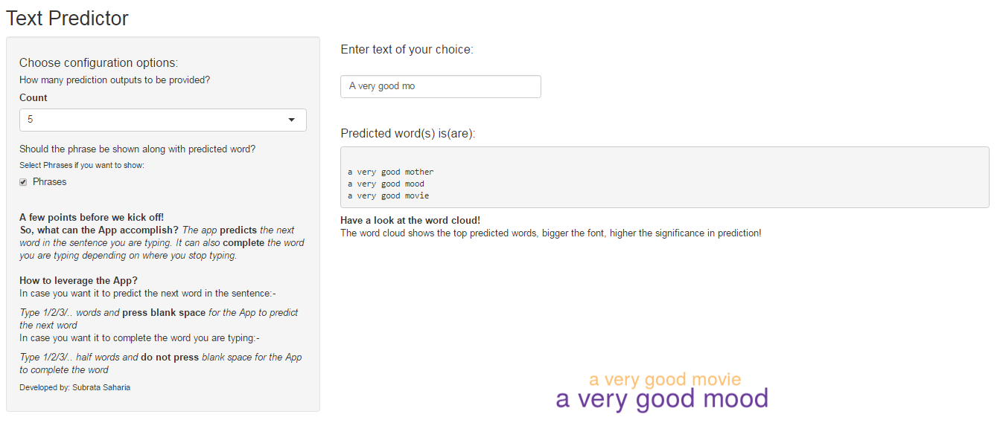

```{r setup, include=FALSE}
knitr::opts_chunk$set(echo = FALSE)
```

## Introduction: Text Predictor Application

The Text Predictor Application can accomplish the following:

1. The app can **predict the next word** in the sentence you are typing.
2. It can also **complete the word** you are typing depending on where you stop    typing. 

Check out the app at the following link:

https://subratasaharia.shinyapps.io/text_predictor/

The github repository for the code is at the following location:


## Design of the App (1/2)

The following steps summarizes the design of the Application:

**Building the N-gram dictionaries**

* Build text corpus separately for News, Blogs and Twitter databases. 
* Sampling rate 5% selected after a few iterations factoring in coverage,memory constraints and size of the corpus. Each corpus built by dividing the   corpus into smaller chunks of 5000 words to tackle memory issues.
* Each corpus is separately text processed to remove numerics, punctuations,non graphical characters, banned words and converted to smaller caps
* Token generator function used create N-grams(1-5) for each corpus
* N-gram dictionaries created by merging the N-grams from each of the corpuses

## Design of the App (2/2)

* Prediction accuracy found to be around 20%. To further improve, we sourced N-grams from the Corpus of Contemporary American English (COCA)
* After a few iterations, we selected the 1-2 grams from the in-house build and 3,4 and 5grams from the COCA source to have an improved accuracy of around 40%

**Building the text-predictor application**

* Each of the N-grams used has been enhanced with the frequency count. Based on the frequency count the conditional probability (Maximum Likelihood Estimate) of the Nth word is calculated based on existence of N-1, N-2 string of words upto N-4.
* Stupid Back off strategy has been implemented to improve accuracy of prediction. In back-off strategy, for a 4 string word, in case the string is not found in the 5 gram model, the algorithm takes the last 3 words of the 4 string and checks for the string in the 4 gram model and keeps going downwards until the string is found. 
* Similarly, the stupid Back off strategy is useful for predicting the Nth word for any string size. The algorithm picks up the string based on the max N-gram available and keeps going downwards to find the string and predicts the Nth word based on MLE.

## Functions in the App

* In the app, we have feature to select the number of predicted words to be presented, arranged in decreasing order of MLE.
* In the app, we also have a feature to either predict the Nth word or to display the entire string that was used to predict the Nth word
* The app also shows a word cloud for the predicted words and is upper capped to the user selection of the number of predicted words to be shown

```{r, out.width = "500px"}

```


## Conclusion and Next Steps

The app is found to be reasonably accurate in prediction and fast in execution. Hope you enjoy the application!

As next steps, we can work on further improving the prediction accuracy and speed in execution by exploring other text prediction algorithms like Interpolation, Katz backoff and Kneyser-Ney smoothing.

*References*

* https://lagunita.stanford.edu/c4x/Engineering/CS-224N/asset/slp4.pdf
* https://github.com/demgenman/ngram-text-prediction
* TM and RWeka vignettes, stackoverflow for specific queries
* Davies, Mark. (2011) N-grams data from the Corpus of Contemporary American English (COCA). Downloaded from http://www.ngrams.info on June 9, 2017